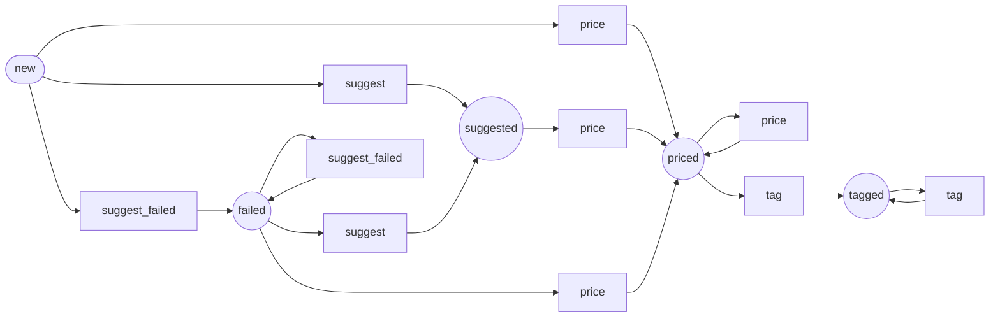

Workflow: item
==============

*Generated by `doc:workflows` on `2026-08-24T18:38:32+00:00`. Type: workflow.*

Diagram
-------



[High-resolution SVG](item.svg)

Places
------

* `new` *(initial)* — Photos (and maybe a spoken note) uploaded from the phone. Nothing has looked at them yet.
* `suggested` — AI has proposed a title, a description and a price. Waiting on a human to agree.
* `priced` — A person confirmed the price. Ready to have a label printed and to go on a table.
* `tagged` — A price tag came out of the Zebra for this one.
* `failed` — The suggestion could not be made — usually an unreadable photo or a missing API key. Fixable, then retry.

Transitions
-----------

|Transition|From|To|
|:-|:-|:-|
|`suggest`|`new`|`suggested`|
|`suggest`|`failed`|`suggested`|
|`suggest_failed`|`new`|`failed`|
|`suggest_failed`|`failed`|`failed`|
|`price`|`new`|`priced`|
|`price`|`suggested`|`priced`|
|`price`|`failed`|`priced`|
|`price`|`priced`|`priced`|
|`tag`|`priced`|`tagged`|
|`tag`|`tagged`|`tagged`|

Listeners
---------

*App listeners subscribed to this workflow's events, with source.*

### `App\Workflow\ItemWorkflow::onSuggest()`

Events: `workflow.item.transition.suggest`

`src/Workflow/ItemWorkflow.php` (L36–L67)

```php
public function onSuggest(TransitionEvent $event): void
{
    $item = $event->getSubject();
    \assert($item instanceof Item);
    $result = $this->pricing->suggest($item);
    if ($result['ok']) {
        $this->em->flush();
        return;
    }
    // Route the failure into the graph rather than throwing. A retry then
    // means applying `suggest` again from `failed`, which the flow already
    // allows — and the item shows up as needing attention instead of
    // sitting at `new` looking untouched.
    $this->logger->warning('priceit: suggestion failed', [
        'item' => $item->getId(),
        'reason' => $result['message'],
    ]);
    if ($this->itemWorkflow->can($item, WF::TRANSITION_SUGGEST_FAILED)) {
        $this->itemWorkflow->apply($item, WF::TRANSITION_SUGGEST_FAILED);
    }
    $this->em->flush();
    // Stop the transition completing, so the item does not land in
    // `suggested` with nothing suggested.
    $event->setBlocked($result['message']);
}
```